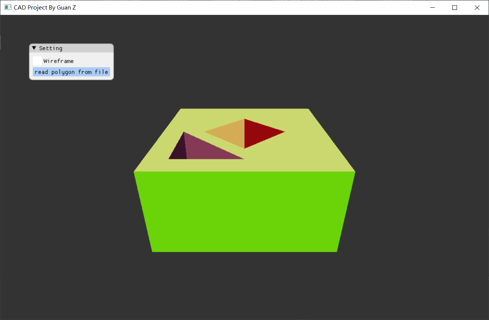
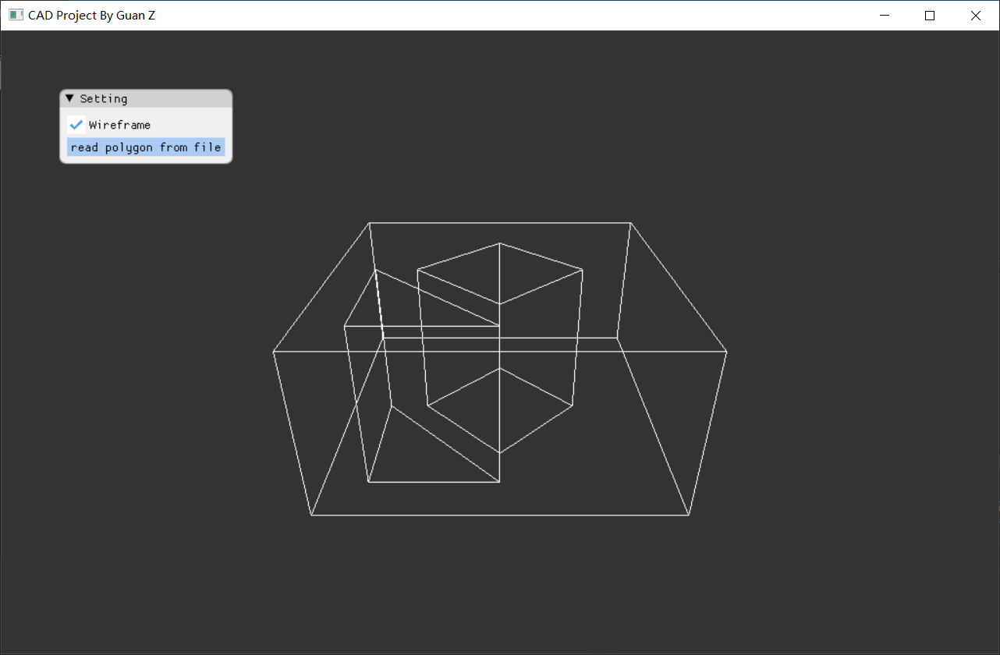
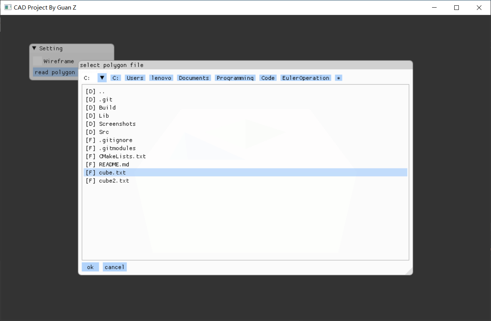

# CAD Project

**姓名**：官庄

**学号**：21921047

## 编译

此项目使用`DirectX 11`进行图形绘制，因此只能在Windows平台上编译运行。此外，项目较激进地使用了许多`C++17`的特性，故需使用版本较新的MSVC编译（`VS2017`或`VS2019`）。项目所需依赖均以放置在`Lib`中，故无需额外配置依赖库，可直接使用`cmake`构建解决方案文件。

此外，我预先用`VS2019`编译了64位版本的程序，放置在程序根目录下，作为因环境问题导致编译失败时的备选演示方案。

## 项目结构

### 依赖库

`Lib/agz-utils`为我一直在编写和维护的工具库，在此项目中主要用于提供数学运算。

`Lib/ImGui`用于GUI绘制，其中文件浏览器为我自行添加。

`Lib/poly2tri`可以将二维多边形三角化，在此项目中用于带孔多边形的绘制。

### 项目文件

`Src/D3D`是对`DirectX 11`图形API的简单封装，拷贝自我的其他项目。

`Src/Euler`为程序主体，实现了欧拉操作和沿直线段的扫成操作。

`Src/Euler/Include/EulerOperation/Solid.h`定义了基于半边数据结构的实体边界表示。

`Src/Euler/Include/EulerOperation/Operation.h`和`Src/Euler/Src/Operation.cpp`实现了五个基本的欧拉操作、沿直线段的扫成操作以及实体的销毁。

`Src/Euler/Include/EulerOperation/Renderer.h`和`Src/Euler/Src/Renderer.cpp`实现了实体的渲染。

`Src/Euler/Include/EulerOperation/Create.h`和`Src/Euler/Src/Create.cpp`实现了用扫成操作从二位多边形创建实体的功能。

`Src/Euler/Src/Main.cpp`为程序入口和主循环。

## 结果展示

启动程序后，程序将自动用扫成操作创建一个带两个通孔的实体，实体的每个面都被随机赋予了一个颜色：



此时在窗口中按住鼠标右键并拖动鼠标，可以调整观察实体的视角；滚动鼠标滚轮则可以调整摄像机和原点间的距离。勾选左上角`Setting`中的`Wireframe`后则会以线框模式展示：



点击左上角`Setting`中的`read polygon from file`，将会弹出一个文件浏览器，可以用它选择多边形文件并自动用扫成操作构造新的实体：



可识别的多边形文件格式如下，其中`#`开头的行为注释行：

```
2

# 文件的第一行必须是一个数，用于表示扫成向量的长度
# 后面的行用于定义一个带孔的二维多边形，程序将用该多边形作为扫成操作的底面
# 注意程序不会检查多边形的几何有效性

# 外环顶点坐标

-3 -3
-3 3
3 3
3 -3

# 每个以'$'都表示开始一个新的内环，下面是两个内环

$
-1 -1
-1 0
0 0
0 -1

$
1 1
1 2
2 2
2 1
```

上述文件内容可以在项目目录下的cube2.txt中找到，读取它所产生的实体为：

